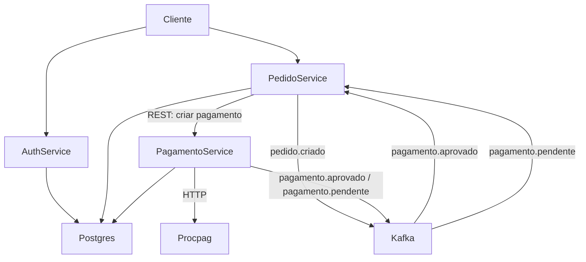
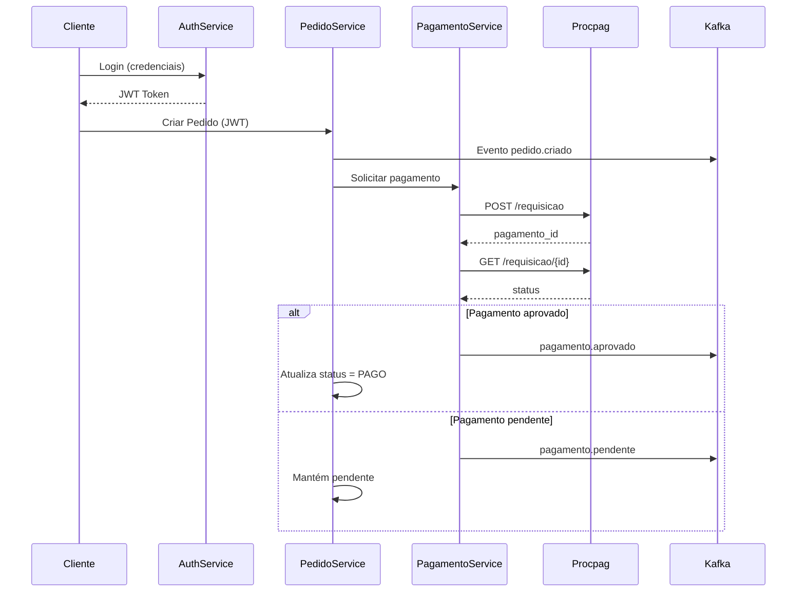

# 🍴 **GestRest MS – Sistema de Gestão de Pedidos de Restaurantes**

**Fase 3 – Tech Challenge - FIAP Pós Tech – Arquitetura e Desenvolvimento em JAVA**

---

## 🧭 Visão geral

Plataforma de gestão de pedidos para restaurantes em arquitetura de microserviços, cobrindo usuários, catálogo, pedidos e pagamentos. A aplicação faz parte da Fase 3 do Tech Challenge.

## 🏗️ Arquitetura

Microserviços independentes baseados em Clean Architecture (Ports & Adapters), com comunicação:

* Síncrona via REST
* Assíncrona via Kafka

Integrações externas:

* Serviço de pagamento (`procpag`)

Principais fluxos:

Cliente → Auth → Pedido → Pagamento → Procpag
Pedido → Kafka → Pagamento (eventos assíncronos)

## 🧱 Visão de Arquitetura




## 🔄 Fluxo de Pedido → Pagamento

Este diagrama representa o fluxo completo de autenticação, criação de pedido, processamento de pagamento e atualização de status, incluindo comunicação síncrona e eventos assíncronos via Kafka.



## 📁 Estrutura

```
gestrest-ms/
├── gestrest-auth-service/
├── gestrest-restaurante-service/
├── gestrest-pedido-service/
├── gestrest-pagamento-service/
└── docker-compose.yml
```

### 📦 Serviços

- **auth-service**: autenticação e gestão de usuários
- **restaurante-service**: gestão de restaurantes e cardápios
- **pedido-service**: processamento de pedidos e orquestração
- **pagamento-service**: processamento de pagamentos e status de cobrança

## 🛠️ Tecnologias

- Java 21
- Spring Boot 3
- PostgreSQL
- JWT 
- Kafka 
- Resilience4j (Circuit Breaker, Retry)
- Docker Compose
- Swagger/OpenAPI
- Maven

## ▶️ Execução

```bash
docker compose up --build
```

## 🧪 Testes

Cada microserviço possui testes unitários. Execute o comando dentro do diretório do serviço:

```bash
cd gestrest-auth-service && ./mvnw test
```

## 📊 Cobertura Jacoco

Após executar os testes em um serviço, abra o relatório em `target/site/jacoco/index.html` dentro do diretório desse serviço.

## 🐳 Serviços executados

O ambiente sobe automaticamente:

* PostgreSQL
* Kafka + Zookeeper
* Serviço externo de pagamento (`procpag`)
* Todos os microserviços

Todos conectados via rede Docker `fase3net`.

## 📖 Documentação da API (Swagger)

Após iniciar os serviços, acesse a documentação Swagger de cada microserviço:

- **Auth Service** (porta 8081): [http://localhost:8081/swagger-ui.html](http://localhost:8081/swagger-ui.html)
- **Restaurante Service** (porta 8082): [http://localhost:8082/swagger-ui.html](http://localhost:8082/swagger-ui.html)
- **Pedido Service** (porta 8083): [http://localhost:8083/swagger-ui.html](http://localhost:8083/swagger-ui.html)
- **Pagamento Service** (porta 8084): [http://localhost:8084/swagger-ui.html](http://localhost:8084/swagger-ui.html)

## 📁 Estrutura

```
gestrest-ms/
├── gestrest-auth-service/
├── gestrest-restaurante-service/
├── gestrest-pedido-service/
├── gestrest-pagamento-service/
└── docker-compose.yml
```

## 👤 Autor

Rafael Mendonça de Brito (RM369933)
